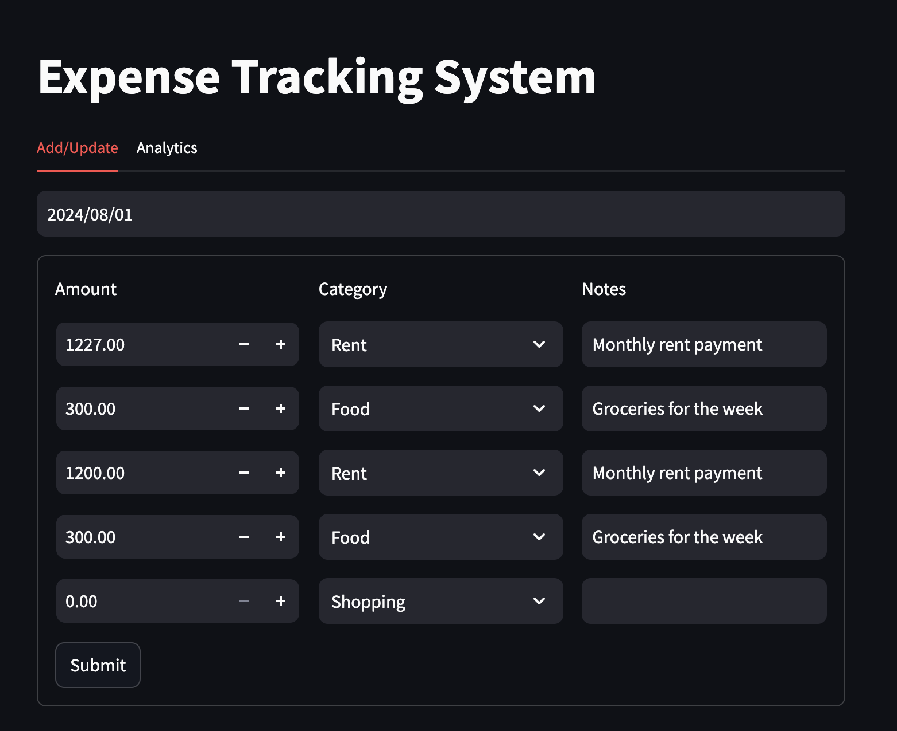
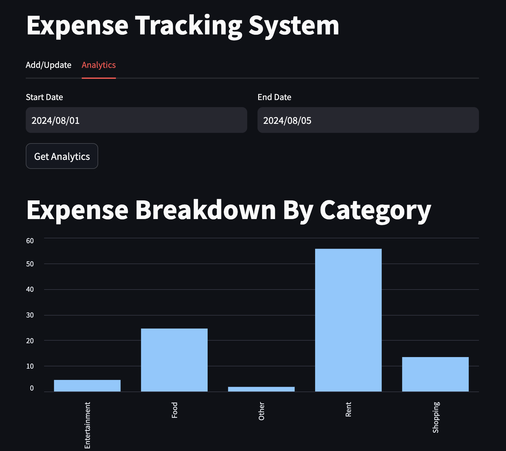

 # Expense Tracking System
Full Stack Expense Management Application (FastAPI + Streamlit)

A modular, production-structured full-stack expense tracking application that allows users to manage daily expenses and visualize category-wise spending analytics.

Built using FastAPI (Backend API) and Streamlit (Frontend UI) following clean architecture principles and REST API communication.

Project Overview:

This application allows users to:

1.Add and update daily expenses

2.Categorize expenses

3.Store notes for each transaction

4.View expense breakdown by category

5.Analyze spending within a custom date range

6.Calculate percentage distribution per category

The project demonstrates clean separation between backend logic and frontend UI.

# Architecture
┌──────────────────────┐
│  Frontend (Streamlit)│
└───────────┬──────────┘
↓
┌──────────────────────┐
│   REST API (HTTP)    │
└───────────┬──────────┘
            
┌──────────────────────┐
│   Backend (FastAPI)  │
└───────────┬──────────┘
            
┌──────────────────────┐
│      Database        │
└──────────────────────┘

# Flow Explanation

User interacts with Streamlit frontend.

Frontend sends HTTP requests using requests.

FastAPI backend processes the request.

Backend interacts with database through db_helper.py.

Response is returned to frontend and displayed.

# Tech Stack
Backend

FastAPI

Uvicorn

Pydantic

Python Logging

Frontend

Streamlit

Requests

Database

SQL-based database (handled via db_helper.py)

# Features
📝 Add / Update Expenses

Select date

Automatically loads existing expenses

Editable 5-row expense form

Category dropdown

Notes support

Filters zero-value entries before saving

📊 Analytics

Select custom date range

Category-wise total expense

Percentage breakdown calculation

JSON structured API response

Ready for chart integration

Example Analytics Response
{
  "Food": {
    "total": 2500,
    "percentage": 35.7
  },
  "Rent": {
    "total": 4500,
    "percentage": 64.3
  }
}

⚙️ Installation & Setup
1️⃣ Clone Repository
git clone <your-repo-url>
cd Expense_Tracking_System

2️⃣ Create Virtual Environment

Mac/Linux:

python -m venv venv
source venv/bin/activate

Windows:

python -m venv venv
venv\Scripts\activate

3️⃣ Install Dependencies
pip install fastapi uvicorn streamlit requests

(Optional) If using requirements file:

pip install -r requirements.txt

▶️ Running the Application
Start Backend

From project root:

uvicorn backend.server:app --reload

Backend runs at:

http://localhost:8000

Start Frontend

Open a new terminal:

cd frontend
streamlit run app.py

Frontend runs at:

http://localhost:8501

#  Streamlit Dashboard

The dashboard looks like this:

Add/Update Tab

Analytics Tab

# Key Learning Outcomes

Building REST APIs using FastAPI

Request validation using Pydantic models

Backend–frontend integration via HTTP

Modular Python project structuring

Form handling and state management in Streamlit

Error handling and logging

Designing scalable architecture